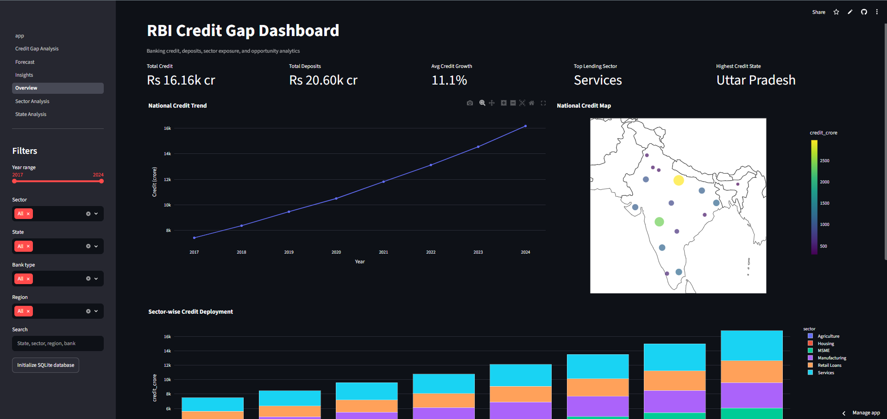
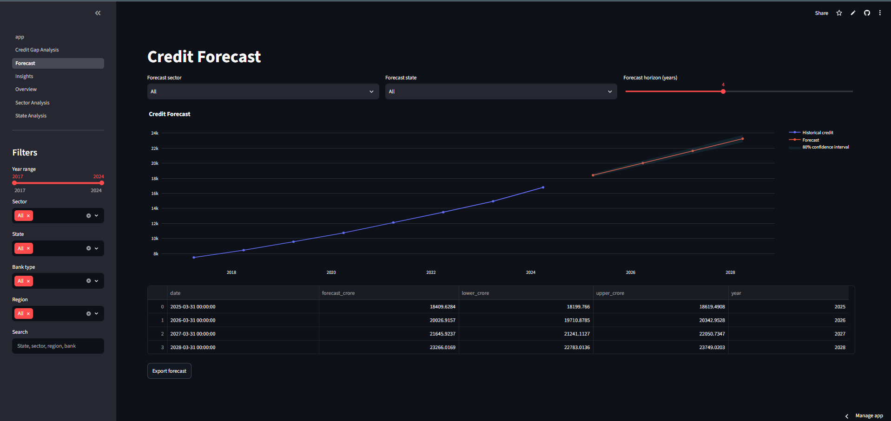

# RBI Credit Gap Dashboard

A production-style Streamlit analytics project for exploring Indian banking credit, deposits, sector exposure, regional lending gaps, and credit growth forecasts. The app is designed as a GitHub portfolio project for business analytics, financial analytics, data engineering, and dashboard development.

The bundled datasets are deterministic, representative RBI-style sample files so the project runs immediately. The data pipeline is modular, so public RBI CSV/XLSX extracts can replace the sample files under `data/raw/` with the same schema.

**Note on data:** All figures in this dashboard are synthetically generated for demonstration purposes and do not represent actual RBI, state, or bank-level data. The generation logic follows realistic ranges and relationships (state population, deposit-credit ratios, sector allocation) so the analytics and visualizations behave as they would on real data. To use real figures, replace the CSV files in `data/raw/` with actual RBI extracts using the same column schema.

## Features

- Multipage Streamlit dashboard with overview, sector analysis, state analysis, credit gap analysis, forecasting, and executive insights.
- Reusable analytics functions for YoY growth, CAGR, moving average, deposit-credit ratio, rankings, and credit gap scoring.
- Credit gap model comparing expected credit with actual credit and ranking underserved states by opportunity index.
- ARIMA/SARIMAX forecasting using `statsmodels`.
- Plotly charts with hover tooltips, PNG export through the Plotly modebar, and CSV export buttons for dashboard tables.
- SQLite persistence layer with tables for `credit_data`, `deposit_data`, `sector_data`, and `state_data`.
- Streamlit caching, filterable sidebar controls, search, responsive layout, and dark-mode compatible charts.
- Unit tests for analytics and data-loading behavior.

## Architecture

```text
rbi-credit-gap-dashboard/
  app.py
  config.py
  data/
    raw/
    processed/
  src/
    load_data.py
    preprocessing.py
    analytics.py
    forecasting.py
    insights.py
    visualizations.py
    database.py
    utils.py
  pages/
    Overview.py
    Sector Analysis.py
    State Analysis.py
    Credit Gap Analysis.py
    Forecast.py
    Insights.py
  tests/
  assets/images/
  notebooks/
```

## Technology Stack

Python 3.12+, Streamlit, pandas, NumPy, Plotly, statsmodels, SQLAlchemy, scikit-learn, requests, openpyxl, pycountry, python-dotenv, SQLite.

## Installation

```bash
git clone <your-repo-url>
cd rbi-credit-gap-dashboard
python -m venv .venv
.venv\Scripts\activate
pip install -r requirements.txt
streamlit run app.py
```

## Usage

1. Open the Streamlit app.
2. Use sidebar filters for year, sector, state, bank type, region, and search.
3. Navigate pages from the Streamlit sidebar.
4. Export tables as CSV using page-level download buttons.
5. Use Plotly's chart toolbar to download charts as PNG.
6. Click "Initialize SQLite database" on the overview page to create `data/processed/rbi_credit_gap.db`.

## Data

Sample raw files:

- `data/raw/state_credit.csv`
- `data/raw/sector_credit.csv`
- `data/raw/deposit_credit.csv`

Suggested public source replacements:

- RBI Handbook of Statistics on the Indian Economy
- Basic Statistical Returns of Scheduled Commercial Banks
- Sectoral Deployment of Bank Credit
- Deposit and Credit of Scheduled Commercial Banks

## Analytics Method

The credit gap page calculates:

- `Expected Credit`
- `Actual Credit`
- `Credit Gap = Expected Credit - Actual Credit`
- `Gap % = Credit Gap / Expected Credit`
- `Opportunity Index`, a weighted score based on positive credit gap, low deposit-credit ratio, and priority-sector headroom

This is a transparent analytical benchmark, not a regulatory credit prescription.

## Screenshots

### Overview


### State Analysis


### Sector Analysis


### Forecast


### Credit Gap Analysis


### Executive Insights


## Testing

```bash
pytest
```

## Deployment

The app is ready for Streamlit Community Cloud:

1. Push this folder to GitHub.
2. Create a Streamlit app pointing to `app.py`.
3. Ensure `requirements.txt` is included.
4. Keep sample data in `data/raw/` or replace it with public RBI extracts.

## Future Improvements

- Add a live RBI ingestion job for selected CSV/XLSX releases.
- Add official Indian state GeoJSON for true choropleth boundaries.
- Add PostgreSQL configuration through environment variables.
- Add model diagnostics and scenario-based forecast assumptions.
- Add authentication for internal bank usage.

## Contributing

Pull requests are welcome. Please keep functions typed, tested, and modular.

## License

MIT License.

